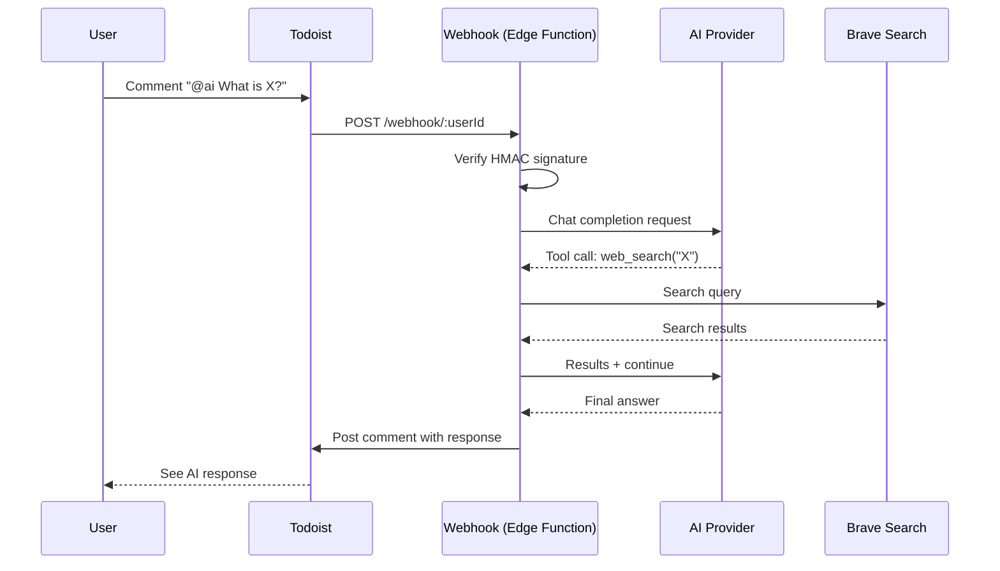
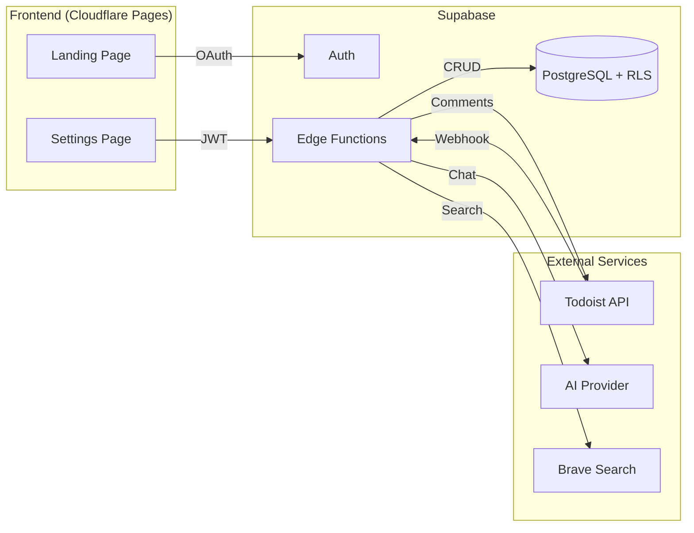

<p align="center">
  
  
  
  
  
</p>

<h1 align="center">Todoist AI Agent</h1>

<p align="center">
  <strong>A multi-tenant SaaS that brings AI-powered conversations to your Todoist tasks.</strong>
</p>

<p align="center">
  Mention <code>@ai</code> in any task comment and get intelligent responses — with web search, conversation memory, and bring-your-own-key support.
</p>

<p align="center">
  <a href="https://todoist-ai-agent.pages.dev"></a>
</p>

<p align="center">
  <a href="https://github.com/viktor-svirsky/todoist-ai-agent/actions/workflows/ci.yml"></a>
  <a href="https://github.com/viktor-svirsky/todoist-ai-agent/actions/workflows/deploy.yml"></a>
  <a href="https://github.com/viktor-svirsky/todoist-ai-agent/actions/workflows/security.yml"></a>
  
  
</p>

---

## How It Works



## Features

| Feature | Description |
|---------|-------------|
| **Self-service onboarding** | Connect via Todoist OAuth in one click |
| **Trigger word** | Customizable per user (default: `@ai`) |
| **Web search** | Real-time information via Brave Search API |
| **Conversation memory** | Full message history per task for contextual responses |
| **Bring your own key** | Use any OpenAI-compatible AI provider |
| **Image support** | Attach images to comments for multimodal AI analysis |
| **Data isolation** | Row Level Security ensures complete tenant separation |
| **Rate limiting** | Per-user request throttling to prevent abuse |
| **Error tracking** | Optional Sentry integration for monitoring |

## Architecture



### Tech Stack

| Layer | Technology |
|-------|------------|
| **Runtime** | Deno 2 (Edge Functions) |
| **Backend** | Supabase Edge Functions (TypeScript) |
| **Frontend** | React 19, Vite, Tailwind CSS 4 |
| **Database** | PostgreSQL with Row Level Security |
| **Auth** | Supabase Auth + Todoist OAuth |
| **Hosting** | Supabase (backend), Cloudflare Pages (frontend) |
| **Monitoring** | Sentry (optional) |

## Project Structure

```
todoist-ai-agent/
├── .github/
│   ├── workflows/
│   │   ├── ci.yml                  # Lint, build, test
│   │   ├── deploy.yml              # Edge Functions + Cloudflare Pages
│   │   ├── security.yml            # npm audit on push/PR/weekly
│   │   └── codeql.yml              # CodeQL static analysis
│   ├── ISSUE_TEMPLATE/             # Bug report & feature request forms
│   ├── pull_request_template.md
│   └── dependabot.yml              # Automated dependency updates
├── supabase/
│   ├── config.toml
│   ├── migrations/                 # Database schema + RLS policies
│   └── functions/
│       ├── _shared/
│       │   ├── ai.ts               # Chat completions + tool loop
│       │   ├── constants.ts        # API URLs, defaults, limits
│       │   ├── crypto.ts           # AES-256-GCM encryption + HMAC verification
│       │   ├── messages.ts         # Comment → message parsing
│       │   ├── search.ts           # Brave Search client
│       │   ├── sentry.ts           # Error tracking
│       │   ├── supabase.ts         # Supabase client factories
│       │   ├── todoist.ts          # Todoist REST API client
│       │   ├── rate-limit.ts      # Per-user rate limiting
│       │   └── validation.ts       # Input validation
│       ├── auth-callback/          # OAuth flow handler
│       ├── webhook/                # Todoist webhook processor
│       ├── settings/               # User config CRUD
│       └── tests/                  # Deno test suite
├── frontend/
│   └── src/
│       ├── pages/
│       │   ├── Landing.tsx         # OAuth initiation
│       │   ├── AuthCallback.tsx    # OAuth completion
│       │   └── Settings.tsx        # User preferences
│       └── lib/supabase.ts         # Supabase client
├── .env.example                    # Environment template
├── deno.json                       # Deno configuration
└── package.json                    # Root scripts
```

## Getting Started

### Prerequisites

- [Node.js](https://nodejs.org/) 22+
- [Supabase CLI](https://supabase.com/docs/guides/cli)
- [Deno](https://deno.land/) (for running tests locally)
- A [Todoist App](https://developer.todoist.com/appconsole.html) (Client ID + Secret)

### 1. Clone and install

```bash
git clone https://github.com/viktor-svirsky/todoist-ai-agent.git
cd todoist-ai-agent
npm install
cd frontend && npm install && cd ..
```

### 2. Start Supabase

```bash
npx supabase start
npx supabase db reset   # applies migrations
```

### 3. Configure environment

Create **`supabase/.env.local`**:

```env
TODOIST_CLIENT_ID=your_client_id
TODOIST_CLIENT_SECRET=your_client_secret
DEFAULT_AI_BASE_URL=https://api.anthropic.com/v1
DEFAULT_AI_API_KEY=your_api_key
DEFAULT_AI_MODEL=claude-sonnet-4-6
DEFAULT_BRAVE_API_KEY=your_brave_key    # optional
PUBLIC_SITE_URL=http://localhost:5173
SENTRY_DSN=your_sentry_dsn              # optional

# Required: encryption key for sensitive DB columns (AES-256-GCM)
# Generate with: deno -e "console.log(btoa(String.fromCharCode(...crypto.getRandomValues(new Uint8Array(32)))))"
ENCRYPTION_KEY=your_generated_key
```

Create **`frontend/.env.local`**:

```env
VITE_SUPABASE_URL=http://127.0.0.1:54321
VITE_SUPABASE_ANON_KEY=<anon key from supabase start output>
VITE_TODOIST_CLIENT_ID=your_client_id
```

### 4. Run locally

```bash
# Terminal 1 — Edge Functions
npm run functions:serve

# Terminal 2 — Frontend
npm run frontend:dev
```

### 5. Connect Todoist

Open [localhost:5173](http://localhost:5173), click **Connect Todoist**, and authorize.

## Usage

1. Open any task in Todoist
2. Add a comment: `@ai What should I prioritize this week?`
3. The agent responds as a new comment
4. Continue the conversation — full history is preserved per task for context

## Development

### Commands

```bash
npm run supabase:start      # Start local Supabase
npm run supabase:stop       # Stop local Supabase
npm run supabase:reset      # Reset database (re-apply migrations)
npm run functions:serve     # Serve Edge Functions locally
npm run frontend:dev        # Start frontend dev server
npm run frontend:build      # Build frontend for production
npm test                    # Run Deno test suite
```

### Running Tests

```bash
# All tests
npm test

# With coverage
deno test supabase/functions/tests/ --no-check --coverage

# Specific test file
deno test supabase/functions/tests/crypto.test.ts --no-check --allow-env
```

### Test Coverage

150 tests covering shared modules and edge functions:

| Module | Tests | What's covered |
|--------|-------|----------------|
| **messages.ts** | 30 | Comment parsing, trigger word stripping, special chars, normalize helpers |
| **rate-limit.ts** | 29 | Per-user rate limiting, sliding window, concurrent requests |
| **ai.ts** | 25 | `buildMessages` (custom prompts, images, edge cases), `executePrompt` (success, errors, tool calls) |
| **validation.ts** | 25 | All settings fields: type checks, boundaries, nulls, multi-field errors |
| **todoist.ts** | 15 | All TodoistClient methods: API calls, auth headers, error handling, trusted domains |
| **crypto.ts** | 13 | AES-256-GCM encrypt/decrypt round-trips, HMAC verification, key errors |
| **search.ts** | 6 | Brave Search: result mapping, params, headers, empty/error responses |
| **sentry.ts** | 4 | `withSentry` wrapper, error handling, `captureException` no-op |
| **webhook** | 1 | Webhook handler integration |
| **auth-callback** | 1 | OAuth callback integration |
| **settings** | 1 | Settings CRUD integration |

### Linting

```bash
cd frontend && npm run lint     # ESLint for frontend
deno lint supabase/functions/   # Deno lint for Edge Functions
```

## CI/CD

| Workflow | Trigger | What it does |
|----------|---------|--------------|
| **CI** | Push & PR to `main` | Lint, test, and build frontend; run Deno tests |
| **Deploy** | Push to `main` | Deploy Edge Functions to Supabase, build & deploy frontend to Cloudflare Pages |
| **Security Audit** | Push & PR to `main`, weekly | Run `npm audit` on root and frontend dependencies |
| **CodeQL** | Push & PR to `main`, weekly | Static analysis for JavaScript/TypeScript security vulnerabilities |
| **Dependabot** | Weekly (Monday) | Open PRs for outdated npm packages and GitHub Actions |

## Security

| Measure | Implementation |
|---------|---------------|
| **Webhook verification** | HMAC-SHA256 signature on every Todoist webhook |
| **Data encryption** | AES-256-GCM for sensitive DB columns (tokens, API keys) |
| **Data isolation** | PostgreSQL Row Level Security per user |
| **Authentication** | JWT-based via Supabase Auth |
| **Secrets management** | All credentials in environment variables |
| **Input validation** | Server-side validation on all user settings |
| **Dependency scanning** | Automated npm audit, Dependabot, and CodeQL static analysis |
| **Image limits** | 4 MB max per attachment |

## License

[ISC](LICENSE)
