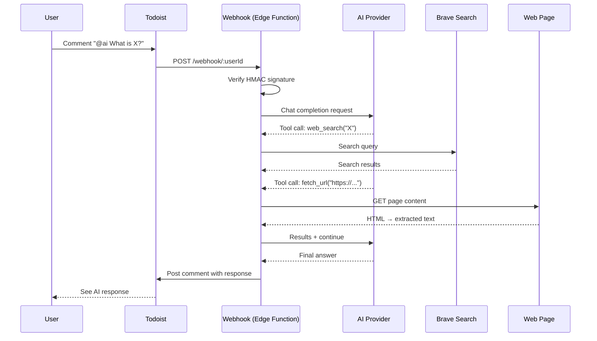
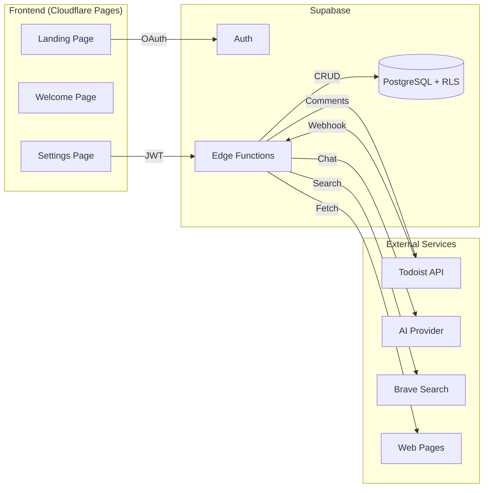

<p align="center">
  
  
  
  
  
</p>

<h1 align="center">Todoist AI Agent</h1>

<p align="center">
  <strong>A multi-tenant SaaS that brings AI-powered conversations to your Todoist tasks.</strong>
</p>

<p align="center">
  Mention <code>@ai</code> in any task comment and get intelligent responses — with web search, conversation memory, and bring-your-own-key support.
</p>

<p align="center">
  <a href="https://todoist-ai-agent.pages.dev"></a>
</p>

<p align="center">
  <a href="https://github.com/viktor-svirsky/todoist-ai-agent/actions/workflows/ci.yml"></a>
  <a href="https://github.com/viktor-svirsky/todoist-ai-agent/actions/workflows/deploy.yml"></a>
  <a href="https://github.com/viktor-svirsky/todoist-ai-agent/actions/workflows/security.yml"></a>
   <!-- x-release-please-version -->
  
</p>

---

## How It Works



## Features

| Feature | Description |
|---------|-------------|
| **Self-service onboarding** | Connect via Todoist OAuth in one click, with a guided welcome page |
| **Trigger word** | Customizable per user (default: `@ai`) |
| **Web search** | Real-time information via Brave Search API |
| **URL reading** | Fetch and read web page content from links shared in comments |
| **Conversation memory** | Full message history per task |
| **Rate limiting** | Per-user webhook and settings rate limits with account blocking |
| **Bring your own key** | Supports Anthropic (Claude) and any OpenAI-compatible provider, with key validation before save |
| **Image support** | Attach images to comments for multimodal AI analysis |
| **File attachments** | Attach PDFs (Anthropic native) or text-based files (.txt, .md, .csv, .json, .py, .sh, etc.) for AI analysis |
| **Data isolation** | Row Level Security ensures complete tenant separation |
| **Error tracking** | Optional Sentry integration for monitoring |
| **Accessible UI** | ARIA labels, focus management, keyboard navigation, screen reader support |

## Tiers

- **Free** — 5 AI messages per rolling 24 hours.
- **Pro** — Unlimited. $5/mo via Stripe Checkout; cancel/manage card via Stripe Billing Portal.
- **BYOK** — Unlimited; any account with a non-empty custom AI key. Setting a BYOK key while on Pro auto-schedules subscription cancel at period end.

See `docs/superpowers/specs/2026-04-21-tier-quota-design.md` and `docs/superpowers/specs/2026-04-21-stripe-integration-design.md` for the full design.

Pricing page: `<APP_URL>/pricing` (public). Set `VITE_BILLING_ENABLED=true` once Stripe (sub-project B) is live.

### Gated features

| Feature | Free | Pro | BYOK |
|---------|------|-----|------|
| Web search (`web_search` tool) | ❌ | ✅ | ✅ |
| Todoist tools | Read-only (`list_tasks`, `list_projects`, `list_labels`) | Full CRUD | Full CRUD |
| Custom system prompt | ❌ (ignored) | ✅ | ✅ |
| Custom AI model override | ❌ (rejected on write) | ❌ (ignored at runtime) | ✅ |

Enforcement is server-side in `_shared/feature-gates.ts` (runtime) and `settings/handler.ts` (write-time G4). Telemetry lands in `feature_gate_events`. Ops guide: `docs/ops/feature-gating-runbook.md`.

### Settings → Usage tab

Read-only dashboard with live 24h count, 7-day bar chart, 30-day summary, optional tool breakdown, and streamed CSV export (`GET /settings/usage` and `GET /settings/usage.csv`). Spec: `docs/superpowers/specs/2026-04-21-usage-dashboard-design.md`; ops: `docs/ops/tier-quota-runbook.md`.

## Stripe

Required env vars in `supabase/.env.local`:

```env
STRIPE_SECRET_KEY=sk_test_...
STRIPE_WEBHOOK_SECRET=whsec_...
STRIPE_PRICE_ID_PRO_MONTHLY=price_...
APP_URL=http://localhost:5173
```

Local dev loop with Stripe CLI:

```bash
# Forward live test events to your local webhook (prints whsec_... — paste into .env.local)
stripe listen --forward-to http://127.0.0.1:54321/functions/v1/stripe-webhook

# Drive specific events
stripe trigger checkout.session.completed
stripe trigger customer.subscription.deleted
stripe trigger charge.refunded
```

Operations, secret rotation, and SQL recipes: `docs/ops/stripe-runbook.md`.

## Architecture



### Tech Stack

| Layer | Technology |
|-------|------------|
| **Runtime** | Deno 2 (Edge Functions) |
| **Backend** | Supabase Edge Functions (TypeScript) |
| **Frontend** | React 19, Vite, Tailwind CSS 4 |
| **Database** | PostgreSQL with Row Level Security |
| **Auth** | Supabase Auth + Todoist OAuth |
| **Hosting** | Supabase (backend), Cloudflare Pages (frontend) |
| **Monitoring** | Sentry (optional) |

## Project Structure

```
todoist-ai-agent/
├── .github/
│   ├── workflows/
│   │   ├── ci.yml                  # Lint, test, build
│   │   ├── codeql.yml              # CodeQL code scanning
│   │   ├── deploy.yml              # Edge Functions + Cloudflare Pages
│   │   └── security.yml            # npm audit
│   ├── ISSUE_TEMPLATE/             # Bug report & feature request forms
│   ├── pull_request_template.md
│   └── dependabot.yml              # Automated dependency updates
├── supabase/
│   ├── config.toml
│   ├── migrations/                 # Database schema + RLS policies
│   └── functions/
│       ├── _shared/
│       │   ├── ai.ts               # Chat completions + tool loop
│       │   ├── constants.ts        # API URLs, defaults, limits
│       │   ├── crypto.ts           # AES-256-GCM encryption, HMAC verification, OAuth state signing
│       │   ├── fetch-url.ts        # URL fetcher with SSRF protection + HTML-to-text
│       │   ├── messages.ts         # Comment → message parsing
│       │   ├── rate-limit.ts       # Per-user rate limiting + account blocking
│       │   ├── search.ts           # Brave Search client
│       │   ├── sentry.ts           # Error tracking
│       │   ├── supabase.ts         # Supabase client factories
│       │   ├── todoist.ts          # Todoist REST API client
│       │   └── validation.ts       # Input validation
│       ├── auth-start/             # OAuth initiation (CSRF-protected)
│       ├── auth-callback/          # OAuth completion handler
│       ├── webhook/                # Todoist webhook processor
│       ├── settings/               # User config CRUD
│       ├── health/                 # Health check endpoint (env + DB)
│       └── tests/                  # Deno test suite
├── frontend/
│   └── src/
│       ├── components/
│       │   ├── PageFooter.tsx      # Shared footer links
│       │   └── StepList.tsx        # Reusable step-list component
│       ├── pages/
│       │   ├── Landing.tsx         # OAuth initiation
│       │   ├── AuthCallback.tsx    # OAuth completion
│       │   ├── Welcome.tsx         # Post-OAuth onboarding
│       │   └── Settings.tsx        # User preferences (Basic/Advanced tabs)
│       └── lib/
│           ├── supabase.ts         # Supabase client
│           └── sentry.ts           # Error tracking
├── .env.example                    # Environment template
├── deno.json                       # Deno configuration
└── package.json                    # Root scripts
```

## Getting Started

### Prerequisites

- [Node.js](https://nodejs.org/) 22+
- [Supabase CLI](https://supabase.com/docs/guides/cli)
- [Deno](https://deno.land/) (for running tests locally)
- A [Todoist App](https://developer.todoist.com/appconsole.html) (Client ID + Secret)

### 1. Clone and install

```bash
git clone https://github.com/viktor-svirsky/todoist-ai-agent.git
cd todoist-ai-agent
npm install
cd frontend && npm install && cd ..
```

### 2. Start Supabase

```bash
npx supabase start
npx supabase db reset   # applies migrations
```

### 3. Configure environment

Create **`supabase/.env.local`**:

```env
TODOIST_CLIENT_ID=your_client_id
TODOIST_CLIENT_SECRET=your_client_secret
DEFAULT_AI_BASE_URL=https://api.anthropic.com/v1
DEFAULT_AI_API_KEY=your_api_key
DEFAULT_AI_MODEL=claude-opus-4-6
DEFAULT_AI_FALLBACK_MODEL=claude-sonnet-4-6  # optional, fallback on overload
DEFAULT_BRAVE_API_KEY=your_brave_key    # optional
PUBLIC_SITE_URL=http://localhost:5173
SENTRY_DSN=your_sentry_dsn              # optional

# Required: encryption key for sensitive DB columns (AES-256-GCM)
# Generate with: deno -e "console.log(btoa(String.fromCharCode(...crypto.getRandomValues(new Uint8Array(32)))))"
ENCRYPTION_KEY=your_generated_key
```

Create **`frontend/.env.local`**:

```env
VITE_SUPABASE_URL=http://127.0.0.1:54321
VITE_SUPABASE_ANON_KEY=<anon key from supabase start output>
VITE_SENTRY_DSN=your_sentry_dsn     # optional
```

### 4. Run locally

```bash
# Terminal 1 — Edge Functions
npm run functions:serve

# Terminal 2 — Frontend
npm run frontend:dev
```

### 5. Connect Todoist

Open [localhost:5173](http://localhost:5173), click **Connect Todoist**, and authorize.

## Usage

1. Open any task in Todoist
2. Add a comment: `@ai What should I prioritize this week?`
3. The agent responds as a new comment
4. Continue the conversation — history is preserved per task

## Development

### Commands

```bash
npm run supabase:start      # Start local Supabase
npm run supabase:stop       # Stop local Supabase
npm run supabase:reset      # Reset database (re-apply migrations)
npm run functions:serve     # Serve Edge Functions locally
npm run frontend:dev        # Start frontend dev server
npm run frontend:build      # Build frontend for production
npm test                    # Run Deno test suite
```

### Running Tests

```bash
# Unit + integration tests (mocked HTTP)
npm test

# E2E integration tests (real HTTP — requires network)
npm run test:e2e

# Post-deploy E2E tests (requires TODOIST_TEST_TOKEN)
TODOIST_TEST_TOKEN=xxx npm run test:e2e:post-deploy

# With coverage
deno test supabase/functions/tests/ --no-check --allow-env --allow-read --coverage --ignore=supabase/functions/tests/e2e/

# Specific test file
deno test supabase/functions/tests/crypto.test.ts --no-check --allow-env --allow-read
```

### Test Coverage

458+ tests covering all shared modules, handlers, and e2e integration:

| Module | Tests | What's covered |
|--------|-------|----------------|
| **ai.ts** | 86 | `buildMessages` (custom prompts, images, documents, edge cases), `executePrompt` (OpenAI + Anthropic providers, tool calls, multi-tool batching, model fallback on overload, fetch_url tool, document block conversion), `formatLinksForTodoist` (bare URL conversion, markdown link preservation, edge cases) |
| **validation.ts** | 58 | All settings fields: type checks, boundaries, nulls, multi-field errors, SSRF prevention |
| **messages.ts** | 42 | Comment parsing, trigger word stripping, special chars, image/file attachments, normalize helpers |
| **webhook** | 42 | HMAC verification, rate limiting, idempotency, request validation, image/document downloads, fetch_url/web_search tool call e2e |
| **fetch-url.ts** | 34 | `htmlToText` (tag stripping, entity decoding, whitespace), `fetchUrl` (SSRF blocking, redirect following with SSRF validation, content-type filtering, size limits, error handling) |
| **rate-limit.ts** | 29 | Config parsing, env overrides, rate limit checks, account blocking |
| **settings** | 27 | CRUD operations, auth, rate limiting, field validation, API key validation |
| **crypto.ts** | 22 | AES-256-GCM encrypt/decrypt round-trips, HMAC verification, OAuth state signing/verification |
| **retry.ts** | 18 | Retry logic: GET/POST behavior, status codes, network errors |
| **todoist.ts** | 15 | All TodoistClient methods: API calls, auth headers, error handling, trusted domains |
| **env.ts** | 12 | Environment variable validation |
| **auth-callback** | 10 | OAuth flow, token exchange, CSRF state verification, error handling |
| **health** | 8 | Health check endpoint |
| **search.ts** | 6 | Brave Search: result mapping, params, headers, empty/error responses |
| **sentry.ts** | 6 | `withSentry` wrapper, error handling, `captureException` no-op |
| **auth-start** | 4 | OAuth initiation, CORS, state signing, error handling |
| **e2e integration** | 24+ | Real HTTP: `fetchUrl` against live pages (httpbin, Wikipedia, GitHub), `braveSearch` with real API, tool call pipeline, redirect following, SSRF blocking |
| **e2e post-deploy** | 4 | Full Todoist flow: AI response, URL fetching, web search, error handling via real webhook |

### Linting

```bash
cd frontend && npm run lint     # ESLint for frontend
deno lint supabase/functions/   # Deno lint for Edge Functions
```

## CI/CD

| Workflow | Trigger | What it does |
|----------|---------|--------------|
| **CI** | Push & PR to `main` | Lint, test & build frontend; run Deno tests; e2e integration tests (real HTTP) |
| **CodeQL** | Push & PR to `main`, weekly | Code scanning for security vulnerabilities |
| **Deploy** | Push to `main` | Validate secrets, deploy Edge Functions + frontend, post-deploy health check, E2E smoke tests, backend e2e (real HTTP + Todoist flow) |
| **Security Audit** | Push & PR to `main`, weekly | Run `npm audit` on frontend deps; Deno type-check, lockfile verification, and npm audit on backend deps |
| **Dependabot** | Weekly (Monday) | Open PRs for outdated npm packages and GitHub Actions |

## Security

| Measure | Implementation |
|---------|---------------|
| **Webhook verification** | HMAC-SHA256 signature on every Todoist webhook |
| **OAuth CSRF protection** | HMAC-signed state tokens with nonce and expiry |
| **SSRF prevention** | Private hostname blocking + HTTPS-only for custom AI URLs |
| **Webhook idempotency** | Atomic event deduplication prevents duplicate AI responses |
| **Data encryption** | AES-256-GCM for sensitive DB columns (tokens, API keys) |
| **Data isolation** | PostgreSQL Row Level Security per user |
| **Authentication** | JWT-based via Supabase Auth |
| **Secrets management** | All credentials in environment variables |
| **Input validation** | Server-side validation on all user settings |
| **Code scanning** | CodeQL analysis for security vulnerabilities |
| **Dependency scanning** | Automated npm audit + Dependabot |
| **Rate limiting** | Per-user webhook and settings rate limits |
| **Attachment limits** | 4 MB max per image or document attachment, 50k char cap for text file content |
| **URL fetch limits** | 2 MB download cap, 50k char output, 15s timeout, safe redirect following (max 5 hops with SSRF validation) |

## License

[ISC](LICENSE)
